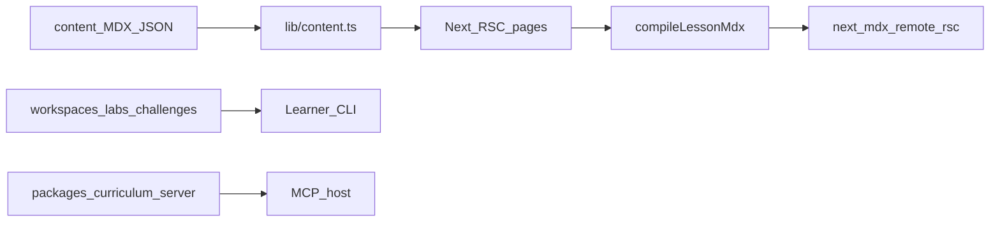

# Architecture

- **Rendering**: `next-mdx-remote/rsc` + remark/rehype plugins (GFM, glossary autolink, slug, autolink headings).
- **Diagrams**: client-side Mermaid via `components/mdx/diagram.tsx`.
- **Search**: dev substring API + optional Pagefind postbuild for static HTML exports.
